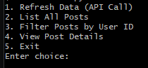
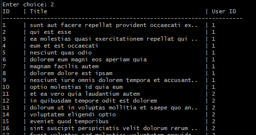

# ParthSarthi-GlobalTrend

This tool fetches data from a public API, caches it locally, and allows users to view and filter the data via a Command Line Interface (CLI).

## Setup Instructions
1. **Prerequisites**: Ensure you have Python 3.x installed.
2. **Installation**:
   This script relies on the `requests` library. Install it using pip:
   ```bash
   pip install requests

## Design Overview

### API & Endpoints Used
I selected **JSONPlaceholder** as the data source.
1. `GET /posts`: Fetches a list of 100 sample blog posts.
2. `GET /users`: Fetches user details to enrich the post data (linking Author Name to Post).

### Filters Implemented
* **User ID**: The CLI allows filtering posts by a specific User ID to narrow down the results.

### Assumptions
* The API structure (field names like `id`, `title`, `userId`) remains constant.
* The user has write permissions in the directory to create the `cache.json` file.

### Preview
Here is the application in action:

**Main Menu:**


**List of Posts:**
